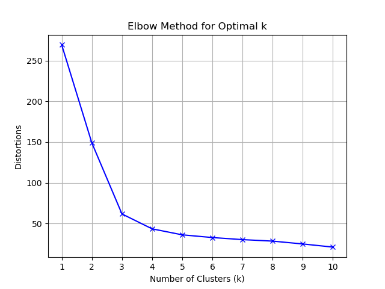
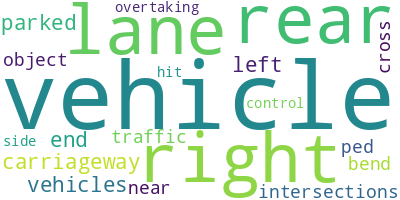
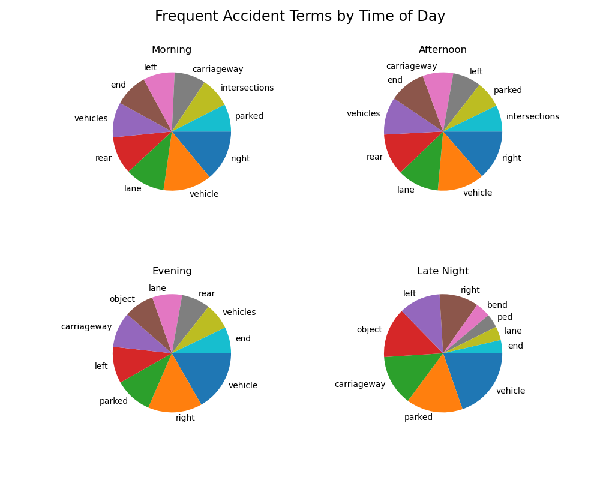

# Traffic Accident Analytics & Crash Pattern Insights

This project applies **data processing, exploratory data analysis (EDA), text mining, and clustering** to uncover insights from traffic accident datasets. Using Python, it analyzes **seatbelt usage behavior**, **frequent accident causes**, **accident timing patterns**, and **vehicle crash characteristics**.

---


## Skills & Techniques Demonstrated

### Data Cleaning & Preprocessing
- Mode imputation, one-hot encoding, age-group binning.
- Regex-based feature extraction (`AGE_GROUP`, `SEATING_POSITION`, `ACCIDENT_TIME`).
- Text preprocessing (tokenization, stopword removal, Bag-of-Words).

### Exploratory Data Analysis & Visualization
- Bar, pie, scatter, and stacked bar charts using `Matplotlib`.
- Word cloud generation for accident causes.
- Grouped aggregations & cross-tabulations using `Pandas`.

### Statistical & Machine Learning Techniques
- Frequency analysis of categorical variables.
- K-Means clustering with **Min-Max scaling** and **Elbow Method**.

### Python Libraries
`pandas`, `matplotlib`, `nltk`, `scikit-learn`, `wordcloud`, `re`

---

## 📌 Key Objectives & Insights


### 1. Vehicle Crash Patterns & Clustering
- **Crash Count Trends:**
  - Grouped by **year, body style, and manufacturer**.
  - **Scatter plot:** Crash counts vs vehicle manufacture year.  
    
- **Clustering of Vehicle Features:**
  - Features: wheels, cylinders, seating capacity, tare weight, and occupants.
  - **Optimal clusters (k=3)** determined via the **Elbow Method**.  
    
  - Exported **Top 10 crash-prone vehicle groups per cluster** (`cluster0.csv`).

---

### 2. Accident Causes & Time-of-Day Patterns
- **Text Mining:**
  - Preprocessed accident descriptions (case-folding, stopword removal, tokenization).
  - Identified top **20 frequent accident-related terms** using Bag-of-Words.
  - **Word cloud visualization:**  
    
- **Accident Timing Patterns:**
  - Categorized into `Morning`, `Afternoon`, `Evening`, `Late Night`.
  - **Bar chart:** Accident counts by time of day.  
    
  - **Pie charts:** Frequent accident terms by time of day.  
    
  - **Stacked bar chart:** Accident counts across Monday, Friday, and Sunday segmented by time of day.  
    

---

### 3. Seatbelt Usage Analysis
- **Data Cleaning & Encoding:**
  - Mode imputation for missing values.
  - One-hot encoding for gender and road user type.
  - Age-group binning (`Under 16`, `17-25`, `26-39`, `40-64`, `65+`).
- **Visual Insights:**
  - **Seatbelt use by age groups:**  

  - **Drivers vs Passengers seatbelt use:**  
    
  - **Front-seat vs Rear-seat passenger seatbelt use:**  
    

---

## How to Run

1. Place all CSVs (`person.csv`, `accident.csv`, `filtered_vehicle.csv`) in the `/course/` directory.
2. Install dependencies:
   ```bash
   pip install pandas matplotlib nltk scikit-learn wordcloud
